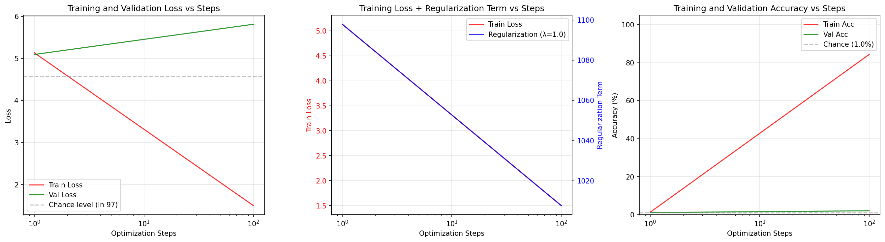

# Grokking Paper Reproduction

A PyTorch implementation reproducing the "grokking" phenomenon from [Grokking: Generalization Beyond Overfitting on Small Algorithmic Datasets](https://arxiv.org/abs/2201.02177) (Power et al., 2022).

## What is Grokking?

Grokking is a phenomenon where neural networks suddenly generalize long after overfitting to the training data. The model first memorizes the training examples (achieving ~100% training accuracy while validation accuracy remains at chance), then much later "discovers" the underlying algorithm, causing validation accuracy to suddenly spike.

## Architecture

Decoder-only transformer following the paper's specifications:
- 2 layers, 128 hidden dimension, 4 attention heads
- ~420K parameters (non-embedding)
- Causal attention masking

## Task

Currently configured for **x² + y² mod 97** (modular arithmetic on a prime field).

The model receives input tokens `[x, +, y, =]` and predicts the result. Tokens 0-96 represent numbers, 97 represents `+`, and 98 represents `=`.

## Training

```bash
pip install -r requirements.txt
python grokking.py
```

**Hyperparameters** (from paper):
- AdamW optimizer: lr=1e-3, weight_decay=1.0, β₁=0.9, β₂=0.98
- Linear warmup over first 10 steps
- Batch size: 512
- Training fraction: 20%

## Results

Training produces `grokking_results.png` with loss and accuracy curves:



## Files

- `grokking.py` — Main training script
- `grokking_results.png` — Training curves
- `grokking_model.pt` — Saved model weights
- `training_history.json` — Training metrics
